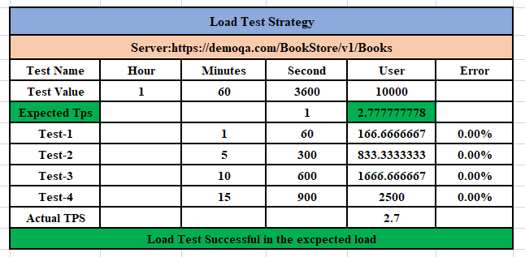
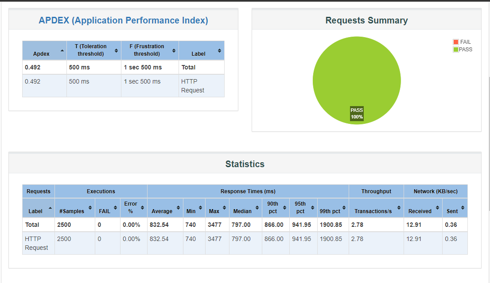

# book_api-load-testing-by-jmeter

### **Mission**

- #### To get the actual TPS(Transection Per Second), when 10000 users visit the website within 1 hour.
- #### [API](https://demoqa.com/BookStore/v1/Books)

### **Output**

- [**Excel and Pdf Report**](https://github.com/tanvirmitul/book_api-load-testing-by-jmeter/tree/main/Excel%20%26%20Word)
(https://docs.google.com/spreadsheets/d/1XUlVISOQO77TmTZ9U99hc58m59wDcGVmfqzuDrkKyJU/edit#gid=0)

  
  
